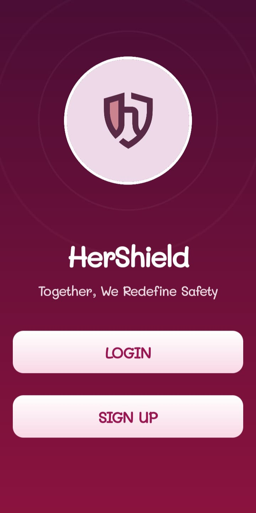
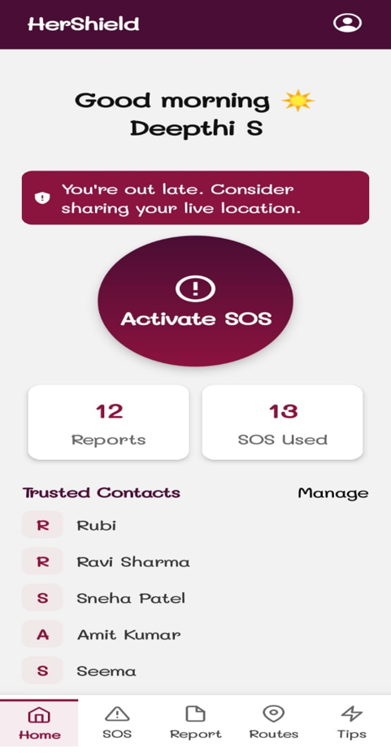
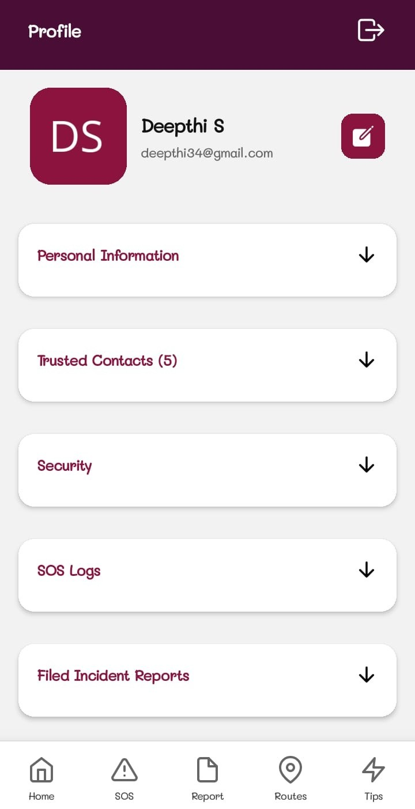
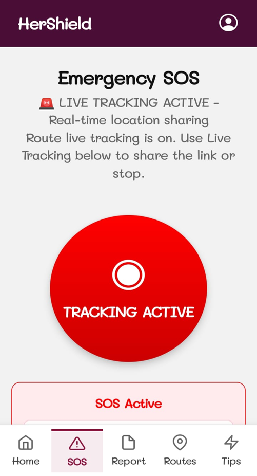
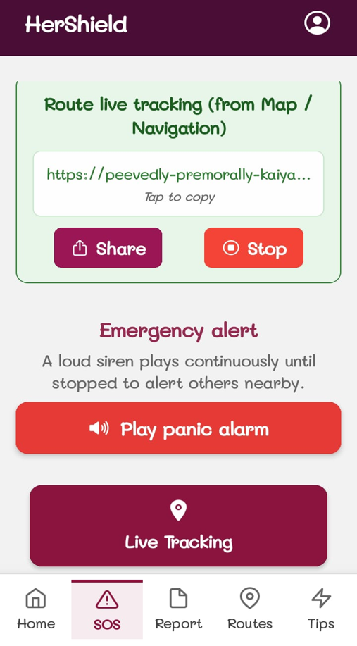
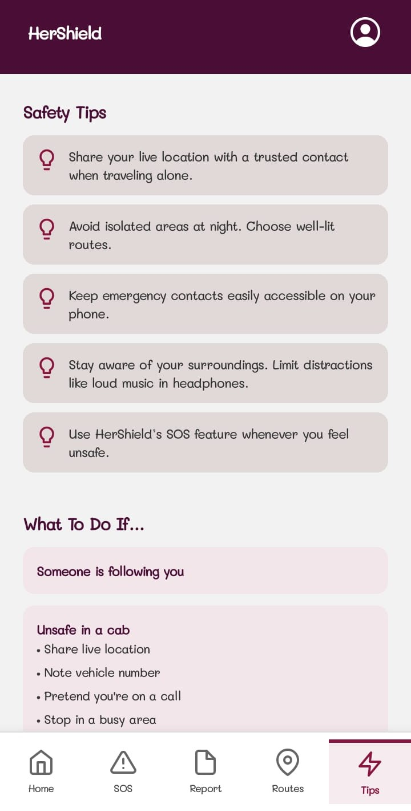
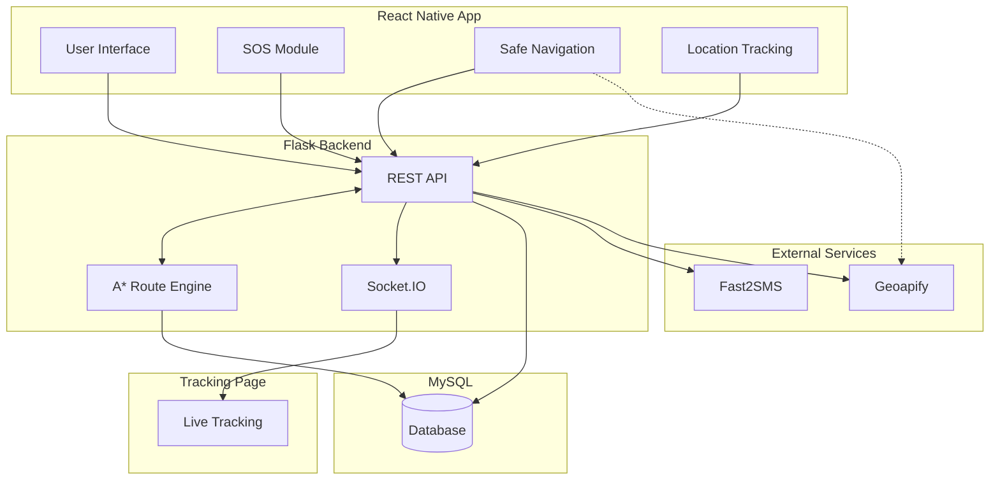

# 🛡️ HerShield

<table>
<tr>
<td width="180">

</td>

<td width="900" align="center">
<h1>HerShield</h1>
<h3><em>Together, We Redefine Safety</em></h3>
</td>
</tr>
</table>

<p align="center">
   &nbsp;&nbsp;&nbsp;
   &nbsp;&nbsp;&nbsp;
   &nbsp;&nbsp;&nbsp;
   &nbsp;&nbsp;&nbsp;
  
</p><br>


## 📝 Project Introduction

HerShield is an Android-based personal safety application built using React Native, Expo, Flask, and MySQL. It combines a mobile application with a Flask backend to provide a reliable platform for personal safety and emergency response.

The system integrates real-time communication, location-based services, and secure user management to help users stay connected, report incidents, and access safety features during emergencies.

<br>

## 📸 Screenshots

A glimpse into the HerShield mobile application.

| Welcome | Dashboard | Profile |
|:-------:|:---------:|:-------:|
|  |  |  |

| SOS Alert | SOS Controls | Safety Tips |
|:---------:|:------------:|:-----------:|
|  |  |  |

<br>

## 📽️ Demo

Watch the complete HerShield walkthrough, including authentication, safe navigation, SOS alerts, and incident reporting.

🎥 **[Watch the HerShield Demo](https://drive.google.com/file/d/1Q2__dDXEC-DbewVCEB5oHOmMOftNTO61/view?usp=sharing)**

<br>

## ✨ Features

### 📱 Mobile Application

- **Secure Authentication:** User registration, login, and profile management.
- **Dashboard:** Access all safety features from a single screen.
- **Safe Navigation:** A*-based route planning using community incident data.
- **Emergency SOS:** Send emergency alerts with live location sharing and SMS notifications.
- **Incident Reporting:** Report nearby incidents with location details.
- **Safety Awareness:** View emergency contacts, safety tips, and self-defense resources.

### ⚙️ Backend Services

- **REST API:** Handles authentication, profiles, incidents, and SOS requests.
- **Database Management:** Stores user accounts, trusted contacts, SOS logs, and incident reports.
- **Live Tracking:** Streams real-time location updates through Socket.IO.
- **Safe Route Engine:** Calculates safer routes using the A* pathfinding algorithm.
- **Geocoding:** Converts coordinates into addresses using Geoapify with an OpenStreetMap fallback.
- **Emergency Notifications:** Sends SMS alerts to trusted contacts through Fast2SMS.

<br>

## 🛠️ Tech Stack

- Mobile: React Native, Expo
- Backend: Flask
- Database: MySQL
- APIs & Services: Fast2SMS, Geoapify, OpenStreetMap

<br>

## 📐 Architecture

HerShield runs on a **client-server architecture** where the React Native application communicates with the Flask backend through REST APIs, while Socket.IO enables real-time location tracking.



### Component Integration & Runtime Flow

1. **SOS Activation:** The mobile app creates an SOS session through the Flask backend.

2. **Emergency Notification:** The backend sends SMS alerts with a live tracking link to trusted contacts.

3. **Live Tracking:** The backend broadcasts real-time location updates to the tracking page using Socket.IO.

4. **Safe Navigation:** The backend generates safer routes using the A* algorithm and incident data.

5. **Data Storage:** MySQL stores user accounts, trusted contacts, incident reports, and SOS logs.
<br>

## 📂 Project Structure

```text
HerShield/
├── mobile-app/             # React Native Expo application
│   ├── App.js              # Main application component
│   ├── index.js            # Expo entry point
│   ├── app.config.js       # Expo configuration
│   ├── package.json        # Project dependencies
│   ├── assets/             # Images, icons, and other resources
│   └── src/
│       ├── components/     # Reusable UI components
│       ├── context/        # Toast notification context
│       ├── navigation/     # Navigation setup
│       ├── screens/        # Application screens
│       ├── services/       # API services
│       └── utils/          # Utility functions
│
├── server/                 # Flask backend
│   ├── app.py              # Backend application
│   └── requirements.txt    # Python dependencies
│
└── DB.sql                  # Database schema
```

<br>

## 🚀 Installation & Setup

### Prerequisites

Before running the project, ensure you have the following installed:

- Python 3.8+
- Node.js 18+ and npm
- MySQL 8.0+
- Android Studio (Emulator) or a physical Android device

### 1. Clone the Repository

```bash
git clone https://github.com/Rdeepthiacharya/HerShield.git
cd HerShield
```

### 2. Set Up the Database

1. Create a MySQL database named `hershield` using SQLyog (or any MySQL client).

```sql
CREATE DATABASE hershield;
```

2. Open the `DB.sql` file from the project root and execute it on the `hershield` database. This creates the required tables and the trigger that limits each user to five trusted contacts.

3. Update the database credentials in `server/.env` to match your local MySQL configuration.

### 3. Backend Setup

1. Navigate to the backend directory and create a virtual environment.

```bash
cd server
python -m venv .venv
```

2. Activate the virtual environment.

```powershell
.venv\Scripts\Activate.ps1
```

3. Install the required Python dependencies.

```bash
pip install -r requirements.txt
```

4. Create a `.env` file inside the `server/` directory and configure it as follows:

```env
# Configuration
NGROK_AUTHTOKEN=your_ngrok_auth_token
FLASK_SECRET_KEY=your_flask_secret_key

# API Keys
FAST2SMS_API_KEY=your_fast2sms_api_key
GEOAPIFY_API_KEY=your_geoapify_api_key

# Database Configuration
DB_HOST=localhost
DB_USER=root
DB_PASSWORD=your_db_password
DB_NAME=hershield
```

### 4. Mobile App Setup

1. Navigate to the mobile application directory.

```bash
cd mobile-app
```

2. Install the project dependencies.

```bash
npm install
```

3. Create a `.env` file inside the `mobile-app/` directory and configure it as follows:

```env
# API Keys
GEOAPIFY_KEY=your_geoapify_api_key

# Flask Backend URL
BASE_URL=http://YOUR_LOCAL_IP:5000
```

> **Note:** Replace `YOUR_LOCAL_IP` with your computer's local IPv4 address so the mobile application can communicate with the Flask backend.

<br>

## ▶️ Running the Application

### 1. Start the Backend Server

Navigate to the `server` directory, activate the virtual environment, and run:

```bash
cd server
python app.py
```

### 2. Launch the Mobile Application

Navigate to the `mobile-app` directory and run:

```bash
cd mobile-app
npx expo run:android
```

> **Note:** Ensure the Flask backend is running before launching the mobile application.

<br>

## 🔒 Security & Privacy

- **Password Security:** Passwords are securely hashed using Werkzeug Security.
- **Trusted Contact Limit:** A MySQL trigger restricts each user to a maximum of five trusted contacts.
- **Secure Tracking Sessions:** Live tracking uses unique session IDs for each SOS session.
- **Privacy Protection:** Incident reports are stored without exposing personal identities.

<br>

## 📄 License

This project is licensed under the MIT License. See the [LICENSE](LICENSE) file for details.

<br>

<p align="center">
<strong>🛡️ HerShield</strong> · Built with React Native, Flask & MySQL
</p>